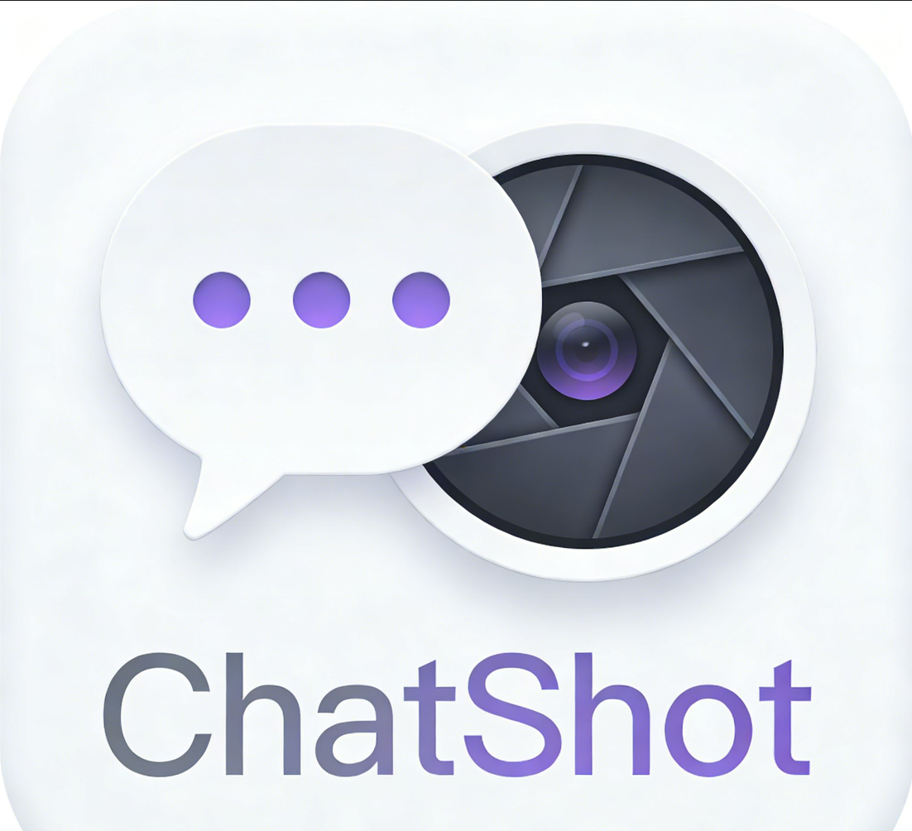

# ChatShot

Capture AI chat responses as beautiful screenshots and stitch them for easy sharing.



## Features

- Block Selection: Choose which content blocks to capture
- Horizontal Stitch: Arrange blocks side by side
- Vertical Stitch: Stack blocks top to bottom
- Auto Theme Detection: Matches dark/light mode
- Response Selector: Capture any conversation response
- Block Merge: Combine small adjacent blocks (Shift+click + Merge)

## Supported Platforms

- [x] DeepSeek (chat.deepseek.com)
- [x] NotebookLM (notebooklm.google.com)
- [x] ChatGPT (chatgpt.com)
- [x] Gemini (gemini.google.com)
- [x] Doubao (www.doubao.com)
- [x] Kimi (www.kimi.com)
- [x] Qianwen (www.qianwen.com)
- [x] ChatGLM (chatglm.cn)
- [ ] Claude (coming soon)

## Installation

### From Source (Developer Mode)

1. Clone this repository:
   ```bash
   git clone https://github.com/70asunflower/ChatShot.git
   ```

2. Open Chrome and go to `chrome://extensions/`

3. Enable **Developer mode** (toggle in top right)

4. Click **Load unpacked** and select the `ChatShot` folder

5. Navigate to a supported AI chat platform and start capturing!

## Usage

1. Open a chat on a supported platform
2. Click **H** (horizontal) or **V** (vertical) button
3. Select/deselect content blocks you want to capture
4. *(Optional)* **Shift+click** adjacent blocks then click **Merge** to combine them
5. Click **Capture** to generate and download the image

## License

MIT License - feel free to use and modify!

## Contributing

Contributions are welcome! Please feel free to submit a Pull Request.
