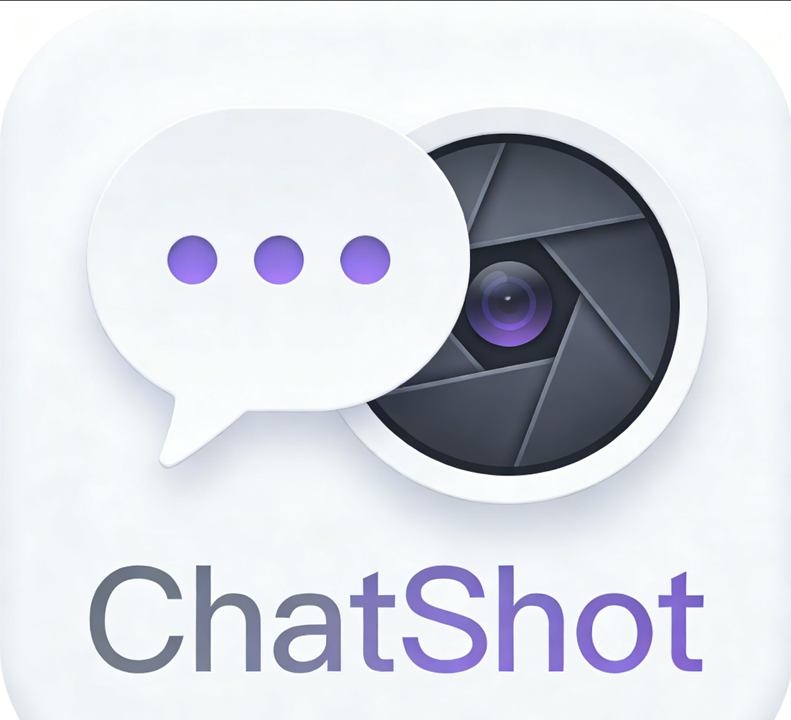
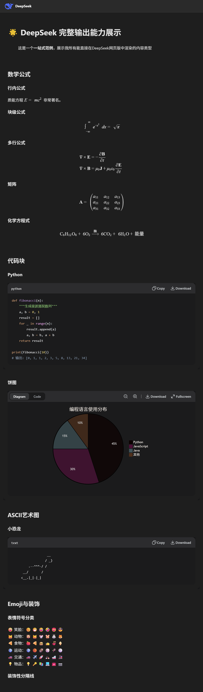
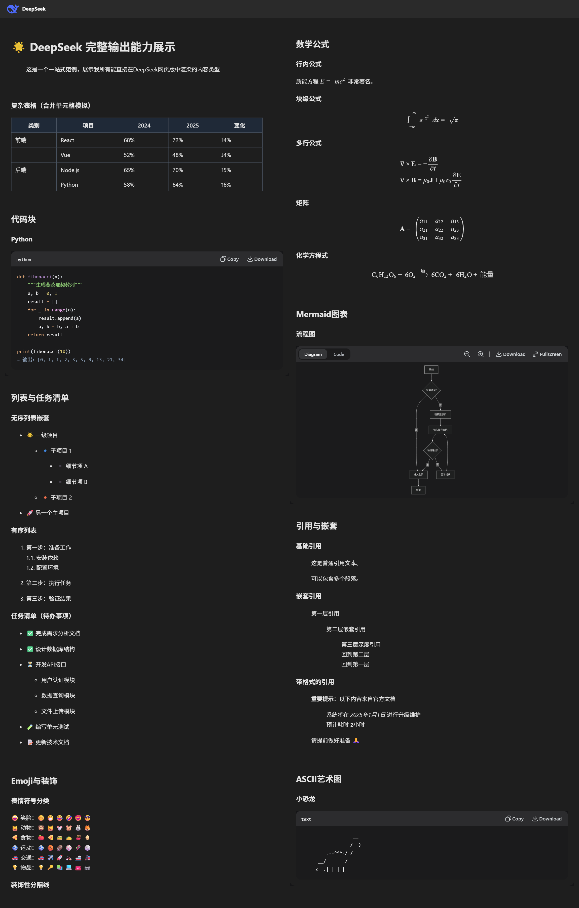

<div align="center">



# 📸 ChatShot

**Capture AI chat responses as beautiful screenshots**

Select → Merge → Stitch → Share

[](https://www.google.com/chrome/)
[](https://www.microsoft.com/edge/)
[](LICENSE)

</div>

<div align="center">
  
</div>

---

## ✨ Why ChatShot?

AI chat responses are hard to share — screenshots are messy, copy-paste loses formatting. ChatShot lets you **select exactly what you want**, **merge blocks together**, and **stitch them into a clean image** — ready to paste anywhere.

## 🖼 Output Examples

<table>
  <tr>
    <td align="center"><b>↕️ Vertical Stack</b></td>
    <td align="center"><b>↔️ Horizontal Masonry</b></td>
  </tr>
  <tr>
    <td></td>
    <td></td>
  </tr>
</table>

## 🎯 Features

| Feature | Description |
|---------|-------------|
| 🧩 **Block Detection** | Auto-detects paragraphs, code, tables, math formulas, Mermaid diagrams |
| ✅ **Selective Capture** | Pick the blocks you want — skip the rest |
| 🔗 **Merge / Unmerge** | Combine adjacent blocks (Shift+click → Merge) or split them back |
| ↔️ **Horizontal Masonry** | Waterfall layout — fills shortest column, no wasted gaps |
| ↕️ **Vertical Stack** | Clean single-column layout |
| 📋 **Auto Clipboard** | Copied to clipboard + downloaded, one click |
| 🌗 **Theme Detection** | Matches dark/light mode automatically |
| 🎨 **Full Rendering** | Syntax highlighting, KaTeX math, Mermaid diagrams, tables |
| 💬 **Response Selector** | Pick any response in the conversation, not just the latest |

### Masonry vs Row Layout

```
Row layout:                  Masonry layout:
+------+ +------+          +------+ +------+
|  1   | |      |          |  1   | |      |
|      | |  2   |          |      | |  2   |
+------+ |      |          +------+ |      |
         +------+          +------+ +------+
-- gap -- -- gap --        |  3   | +------+
+------+                   +------+ |  4   |
|  3   |                            +------+
+------+
```

## 🌐 Supported Platforms

| Platform | URL | Status |
|----------|-----|--------|
| DeepSeek | chat.deepseek.com | ✅ |
| NotebookLM | notebooklm.google.com | ✅ |
| ChatGPT | chatgpt.com | ✅ |
| Gemini | gemini.google.com | ✅ |
| Doubao | www.doubao.com | ✅ |
| Kimi | www.kimi.com | ✅ |
| Qianwen | www.qianwen.com | ✅ |
| ChatGLM | chatglm.cn | ✅ |
| Copilot | copilot.microsoft.com | ✅ |
| Claude | claude.ai | 🔜 |

## 🚀 Installation

### From Source (Developer Mode)

1. **Clone** this repository:
   ```bash
   git clone https://github.com/70asunflower/ChatShot.git
   ```
2. Open Chrome → `chrome://extensions/`
3. Enable **Developer mode** (top right toggle)
4. Click **Load unpacked** → select the `ChatShot` folder
5. Open any supported AI chat → start capturing!

## 📖 Usage

1. Open a chat on a supported platform
2. Click **H** (horizontal masonry) or **V** (vertical stack)
3. Select / deselect blocks you want to capture
4. *(Optional)* **Shift+click** adjacent blocks → **Merge** to combine
5. Click **Capture** — image is downloaded + copied to clipboard

## 🛠 Tech Stack

- **Rendering**: [html-to-image](https://github.com/bubkoo/html-to-image) (SVG foreignObject)
- **Math**: [KaTeX](https://katex.org/) CSS (inline fetched for screenshot compatibility)
- **Syntax Highlighting**: Computed style baking (preserves host-page colors)
- **Manifest**: Chrome Extension Manifest V3

## 📄 License

[MIT](LICENSE) — use it however you like.
